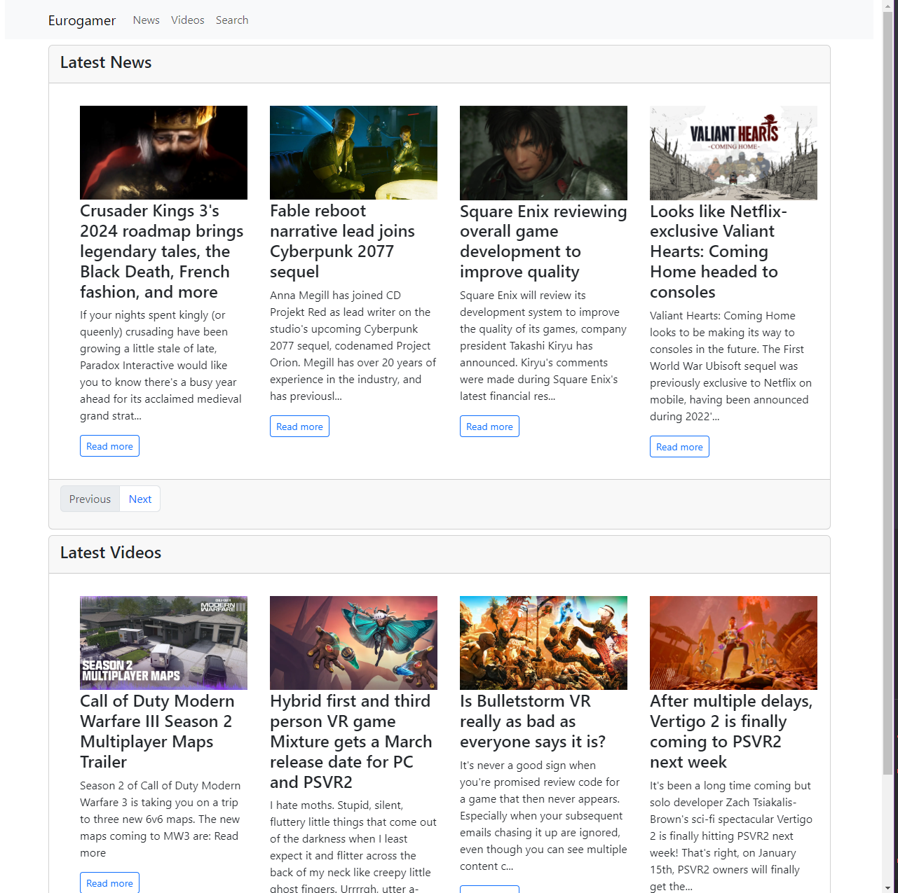
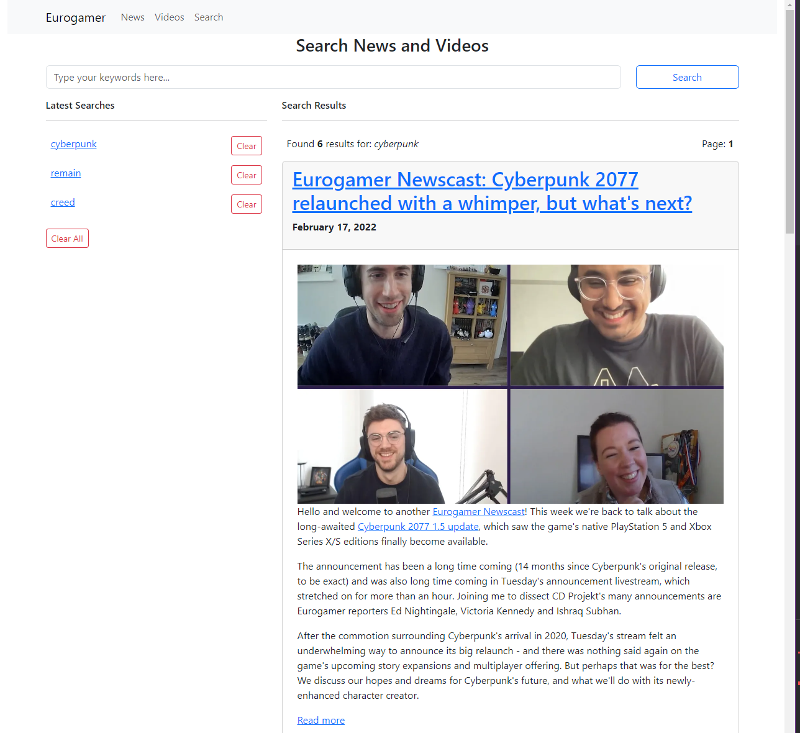

# Gameloft Senior Dev Interview App

### To install
 - cp backend/.env_example backend/.env
 - cp frontend/.env_example frontend/.env
 - cp .env_example .env
 - docker compose up --build or ./install.sh
 - after the installation is done, execute [php artisan migrate] in the backend container

### To grab data from the APIs:
 - docker exec backend php artisan app:scrape-eurogamer-news-feed
 - docker exec backend php artisan app:scrape-eurogamer-videos-feed
 - docker exec backend php artisan schedule:run

### Check the APP
 - FRONTEND: http://localhost:5000
 - API LIVES AT: http://localhost:15000

### Demo:
 
 